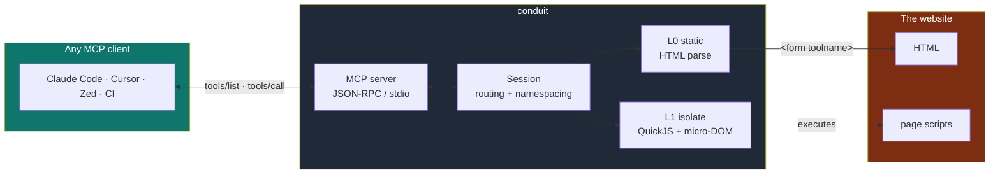
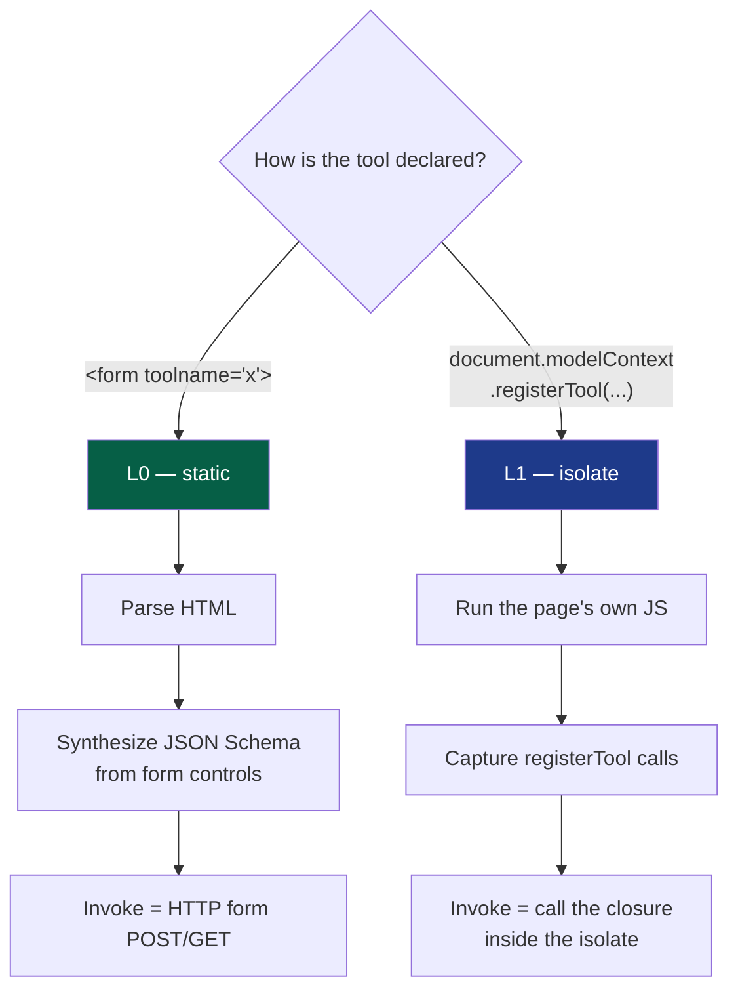
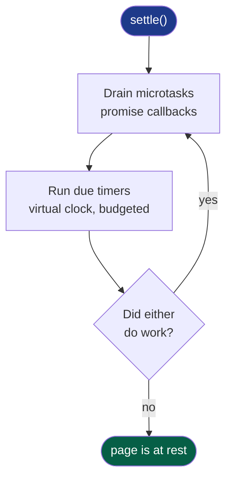
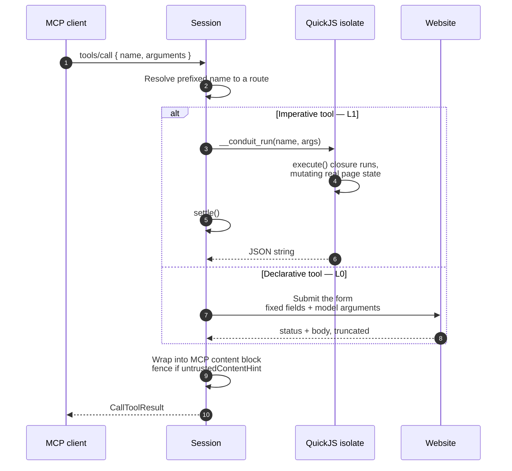
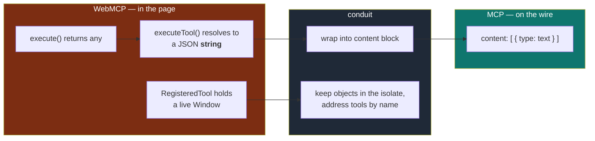
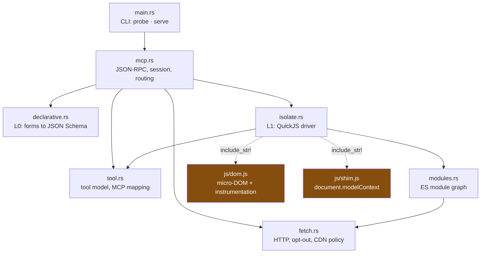

# How conduit works

A WebMCP site hands its tools to an agent by *running JavaScript*. An MCP
client speaks JSON-RPC over a pipe. conduit sits between them — and does it
without a browser.

---

## 1. The shape of the thing



The client never learns that WebMCP exists. It sees an ordinary MCP server.

---

## 2. Why two engines

A WebMCP tool comes in two shapes, and they need completely different handling.



**L0** never executes anything. **L1** has to, because an imperative tool's
`execute` is a *closure over live page state* — there is nothing in the HTML to
parse. The spec sanctions this path directly:

> In-page agents implemented in JavaScript can "observe" the tools that a page
> offers by using the `ModelContext` APIs directly.

---

## 3. Loading a page

```mermaid
sequenceDiagram
    autonumber
    participant CLI as conduit
    participant Net as Website
    participant QJS as QuickJS isolate
    participant Page as Page scripts

    CLI->>Net: GET the page
    Net-->>CLI: HTML + headers

    Note over CLI: Permissions-Policy: tools=() ?<br/>If set, refuse — the site opted out.

    CLI->>CLI: Parse HTML (scraper)
    CLI->>CLI: L0 — extract declarative form tools
    CLI->>CLI: Collect &lt;script&gt; refs

    CLI->>Net: Fetch external scripts<br/>same-origin + known CDNs
    Net-->>CLI: sources

    CLI->>Net: Walk + fetch the ES module graph
    Net-->>CLI: module sources

    Note over CLI,QJS: QuickJS resolves imports synchronously<br/>and cannot await — so the whole graph<br/>must be in hand before evaluation.

    CLI->>QJS: Inject serialized DOM tree
    CLI->>QJS: eval dom.js — the micro-DOM
    CLI->>QJS: eval shim.js — document.modelContext

    CLI->>Page: Run classic scripts
    Page->>QJS: registerTool(...)
    CLI->>CLI: settle()

    CLI->>Page: Evaluate module scripts
    Page->>QJS: registerTool(...)
    CLI->>CLI: settle()

    CLI->>Page: fire DOMContentLoaded · load · pageshow
    Page->>QJS: registerTool(...)
    CLI->>CLI: settle()

    CLI->>QJS: __conduit_harvest()
    QJS-->>CLI: serializable tool list
```

Classic scripts run before modules because browsers defer modules, and inline
classic code often sets up globals a module then expects to find.

---

## 4. `settle()` — the part that makes frameworks work

QuickJS has **no timers**. They are a host facility, not part of the engine.
Without them React's scheduler never gets a turn: a component tree is
scheduled, never rendered, and any `registerTool` inside an effect never runs.



They have to be drained **together**. A timer callback queues promises; a
promise callback schedules more timers. Draining either one alone strands the
other.

Time is *virtual*: the queue is ordered by due time and drained as fast as it
can be, so a page that waits 500 ms does not cost 500 ms of wall clock.

---

## 5. Calling a tool



Page state **persists across calls** — the isolate stays alive for the session.
`add-todo` followed by `list-todos` sees both items, because the second tool
reads the DOM the first one wrote.

---

## 6. Two spec details that are easy to get wrong



1. **`executeTool()` returns a `DOMString`** — the JSON-*stringified* result,
   not an MCP `{content:[...]}` block. Wrapping is conduit's job.
2. **`RegisteredTool` contains a live `Window`**, so it can never cross the
   host boundary. conduit keeps the real objects inside the isolate and passes
   a serializable projection out, addressing tools by name.

---

## 7. Annotations carry the security model

The spec's own mitigations section defines what each hint is for, so conduit
uses them rather than inventing a policy.

| WebMCP annotation | What conduit does |
|---|---|
| `readOnlyHint` | passes through to MCP `readOnlyHint` |
| `consequentialHint` | maps to `destructiveHint` **and** is restated in the description, because many clients surface annotations weakly |
| `untrustedContentHint` | result is fenced in `<untrusted-content>` and labelled as data, never instructions |
| `debugging` | filtered out — never reaches `tools/list` |

Two more boundaries enforced at the transport:

- **`Permissions-Policy: tools=()`** — a browser enforces this before script
  runs. conduit is not a browser, so it checks the header and refuses, rather
  than quietly overriding a site's explicit opt-out.
- **Script origin** — same-origin only, beyond a short list of known script
  CDNs. A page's tools should come from the page.

---

## 8. Where the code lives



The two JS files are compiled into the binary with `include_str!`, so a single
static binary carries its own DOM.

---

## 9. What this is not

conduit is **not a browser**. No layout, no rendering, no canvas.
`getBoundingClientRect` returns zeros; observers construct but stay inert.

Rather than paper over that, every platform API a page reaches for and does not
find is **recorded and reported**:

```console
$ conduit probe https://spa.example
  Platform APIs this page wanted that conduit does not implement:
    - Element.getBoundingClientRect (layout not simulated)
    - IntersectionObserver (constructed, inert)
```

That list is the roadmap. The gap to a real browser is a measurement, not a
guess — which is also why `probe --eval '<js>'` exists, for when the list is
not enough.
