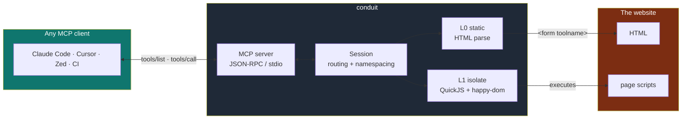
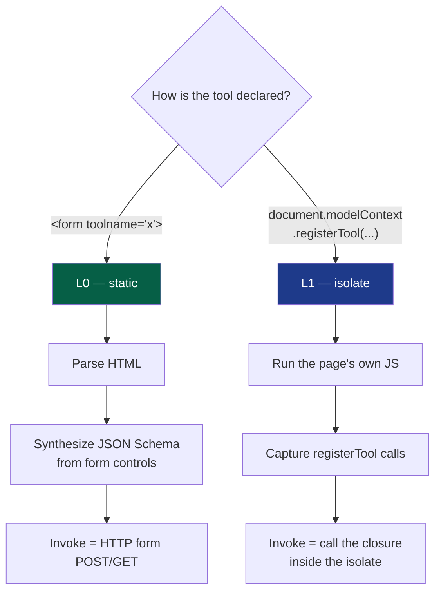
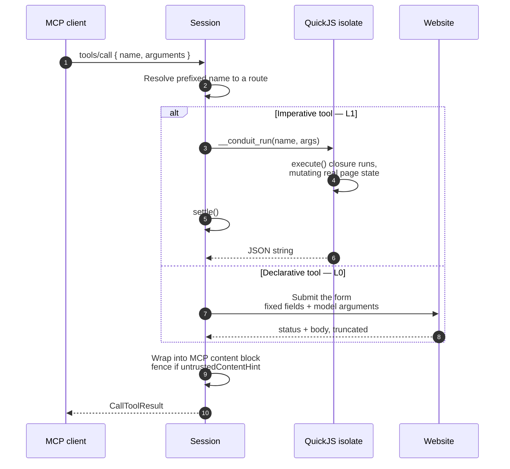
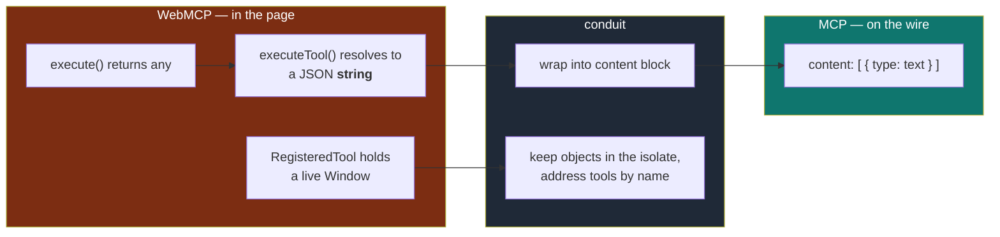
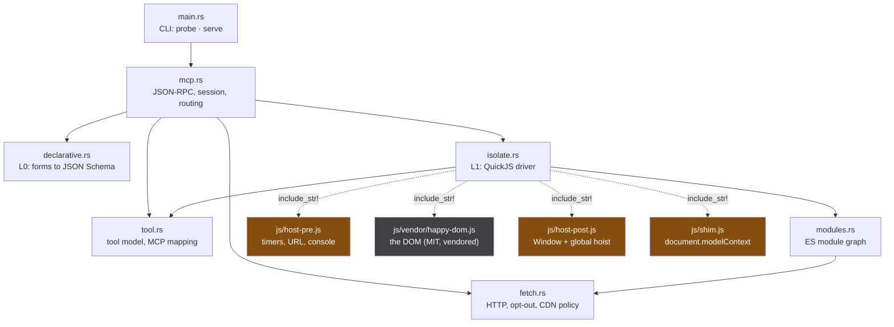
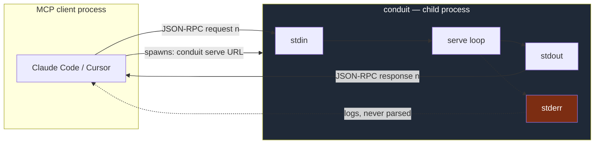

# How conduit works

A WebMCP site hands its tools to an agent by *running JavaScript*. An MCP
client speaks JSON-RPC over a pipe. conduit sits between them — and does it
without a browser.

---

## 1. The shape of the thing



The client never learns that WebMCP exists. It sees an ordinary MCP server.

---

## 2. Why two engines

A WebMCP tool comes in two shapes, and they need completely different handling.



**L0** never executes anything. **L1** has to, because an imperative tool's
`execute` is a *closure over live page state* — there is nothing in the HTML to
parse. The spec sanctions this path directly:

> In-page agents implemented in JavaScript can "observe" the tools that a page
> offers by using the `ModelContext` APIs directly.

---

## 3. Loading a page

```mermaid
sequenceDiagram
    autonumber
    participant CLI as conduit
    participant Net as Website
    participant QJS as QuickJS isolate
    participant Page as Page scripts

    CLI->>Net: GET the page
    Net-->>CLI: HTML + headers

    Note over CLI: Permissions-Policy: tools=() ?<br/>If set, refuse — the site opted out.

    CLI->>CLI: Parse HTML (scraper)
    CLI->>CLI: L0 — extract declarative form tools
    CLI->>CLI: Collect &lt;script&gt; refs

    CLI->>Net: Fetch external scripts<br/>same-origin + known CDNs
    Net-->>CLI: sources

    CLI->>Net: Walk + fetch the ES module graph
    Net-->>CLI: module sources

    Note over CLI,QJS: QuickJS resolves imports synchronously<br/>and cannot await — so the whole graph<br/>must be in hand before evaluation.

    CLI->>QJS: eval host-pre.js — timers, URL, TextEncoder
    CLI->>QJS: eval happy-dom — the DOM
    CLI->>QJS: eval host-post.js — build Window, hoist to global
    CLI->>QJS: happy-dom parses the HTML
    CLI->>QJS: eval shim.js — document.modelContext

    CLI->>Page: Run classic scripts
    Page->>QJS: registerTool(...)
    CLI->>CLI: settle()

    CLI->>Page: Evaluate module scripts
    Page->>QJS: registerTool(...)
    CLI->>CLI: settle()

    CLI->>Page: fire DOMContentLoaded · load · pageshow
    Page->>QJS: registerTool(...)
    CLI->>CLI: settle()

    CLI->>QJS: __conduit_harvest()
    QJS-->>CLI: serializable tool list
```

Classic scripts run before modules because browsers defer modules, and inline
classic code often sets up globals a module then expects to find.

---

## 4. `settle()` — the part that makes frameworks work

QuickJS has **no timers**. They are a host facility, not part of the engine.
Without them React's scheduler never gets a turn: a component tree is
scheduled, never rendered, and any `registerTool` inside an effect never runs.


They have to be drained **together**. A timer callback queues promises; a
promise callback schedules more timers. Draining either one alone strands the
other.

Time is *virtual*: the queue is ordered by due time and drained as fast as it
can be, so a page that waits 500 ms does not cost 500 ms of wall clock.

---

## 5. Calling a tool



Page state **persists across calls** — the isolate stays alive for the session.
`add-todo` followed by `list-todos` sees both items, because the second tool
reads the DOM the first one wrote.

---

## 6. Two spec details that are easy to get wrong



1. **`executeTool()` returns a `DOMString`** — the JSON-*stringified* result,
   not an MCP `{content:[...]}` block. Wrapping is conduit's job.
2. **`RegisteredTool` contains a live `Window`**, so it can never cross the
   host boundary. conduit keeps the real objects inside the isolate and passes
   a serializable projection out, addressing tools by name.

---

## 7. Annotations carry the security model

The spec's own mitigations section defines what each hint is for, so conduit
uses them rather than inventing a policy.

| WebMCP annotation | What conduit does |
|---|---|
| `readOnlyHint` | passes through to MCP `readOnlyHint` |
| `consequentialHint` | maps to `destructiveHint` **and** is restated in the description, because many clients surface annotations weakly |
| `untrustedContentHint` | result is fenced in `<untrusted-content>` and labelled as data, never instructions |
| `debugging` | filtered out — never reaches `tools/list` |

Two more boundaries enforced at the transport:

- **`Permissions-Policy: tools=()`** — a browser enforces this before script
  runs. conduit is not a browser, so it checks the header and refuses, rather
  than quietly overriding a site's explicit opt-out.
- **Script origin** — same-origin only, beyond a short list of known script
  CDNs. A page's tools should come from the page.

---

## 8. Where the code lives



All four JS files are compiled into the binary with `include_str!`, so a single
static binary carries its own DOM. happy-dom is vendored rather than built from
npm at compile time, so `cargo install` needs no Node toolchain — see
`vendor-build/` for how the bundle is regenerated.

---

## 9. How the CLI actually talks to a client

**There is no port.** conduit is not a server you connect to over the network —
the MCP client *launches it as a child process* and talks to it over stdin and
stdout. That is the `stdio` transport.



Three rules follow from this, and breaking any of them breaks the client:

1. **stdout is the transport.** One JSON object per line, newline-delimited.
   A stray `println!` corrupts the stream.
2. **stderr is for humans.** All logging goes there. `CONDUIT_LOG=debug` turns
   up the volume, including the page's own `console` output.
3. **Notifications get no reply.** A JSON-RPC message with no `id` is a
   notification; answering it is a protocol error.

The client config is just a command line:

```json
{ "mcpServers": { "todo": { "command": "conduit", "args": ["serve", "https://todo.example"] } } }
```

### The actual bytes

Request in:

```json
{"jsonrpc":"2.0","id":2,"method":"tools/call",
 "params":{"name":"local__add-todo","arguments":{"text":"milk"}}}
```

Response out:

```json
{"id":2,"jsonrpc":"2.0","result":{"content":[{"text":"{\"added\":\"milk\",\"count\":2}",
 "type":"text"}],"isError":false}}
```

Note the double encoding: `content[0].text` is itself a JSON *string*, because
the WebMCP IDL says `executeTool()` resolves to a `DOMString`. conduit passes
that through verbatim rather than re-parsing and re-shaping it.

### Methods handled

| Method | What conduit does |
|---|---|
| `initialize` | Declares protocol version, capabilities, and an `instructions` string naming the site and which engine served it |
| `tools/list` | Returns the merged L0 + L1 tool list, host-prefixed |
| `tools/call` | Routes to the isolate or to an HTTP form submission |
| `ping` | Empty result |
| anything else | `-32601 method not found` — unless it is a notification, which is ignored |

A **failing tool is not a protocol error**. It comes back as a normal result
with `isError: true`, so the model sees what went wrong and can adapt instead
of the transport falling over.

---

## 10. What each module does

Section 8 shows how they depend on each other; this is what each is *for*.

**`main.rs`** — the CLI surface. Two commands, `probe` and `serve`, plus flags
(`--json`, `--no-scripts`, `--eval`). It also pins the async runtime to a
*single thread*: QuickJS values are not `Send`, so the page and everything
touching it must stay on one thread.

**`mcp.rs`** — the centre of gravity, and where the project's point lives. Two
halves:
- `Session::load()` resolves the target (URL or local file), runs L0, runs L1,
  merges both tool sets, and builds a routing table from prefixed MCP name to
  either `Source::Page` or `Source::Form`.
- `serve()` is the read-a-line, dispatch, write-a-line loop.

**`tool.rs`** — the vocabulary. `WebTool` is a discovered tool regardless of
tier; `to_mcp()` renders it for `tools/list`; `to_mcp_result()` wraps a raw
result and applies the untrusted-content fence. Also the naming rules:
`host_prefix()` and `mcp_tool_name()`.

**`declarative.rs`** — L0. `extract()` finds `<form toolname>` elements and
compiles their controls into a JSON Schema, keeping hidden fields out of the
model-facing schema while carrying them into the submission.

**`isolate.rs`** — L1, and the largest module. Builds the QuickJS runtime,
evaluates the four JS layers in order, runs page scripts, and exposes three
operations to the session: `harvest()`, `call()` and `eval_debug()`. `settle()`
lives here too.

**`modules.rs`** — ES module support. `import_specifiers()` scans a source for
what it imports; `prefetch_graph()` walks and fetches the whole graph. Separate
from `isolate.rs` because it is pure I/O and pure text, and testable as such.

**`fetch.rs`** — HTTP, and the two policy decisions that belong at the
transport: whether the site sent `Permissions-Policy: tools=()`, and whether a
script's origin is allowed to run.

### The JS layers, in load order

| File | Why it exists |
|---|---|
| `host-pre.js` | Web globals QuickJS lacks — timers, `URL`, `TextEncoder`, `performance`, `console`. Must be first: happy-dom *subclasses* `URL` at load time |
| `vendor/happy-dom.js` | The DOM. Vendored, MIT, ~800KB |
| `host-post.js` | Builds the `Window` and hoists it onto `globalThis`, because there is no Node `vm` to make it the global |
| `host-fetch.js` | XMLHttpRequest, backed by the host — the network boundary carries the origin policy, so it is not vendored |
| `vendor/fetch.js` | Spec types: Headers, Request, Response. Loaded after the Window, because happy-dom hoists empty shells of these onto the global |
| `shim.js` | `document.modelContext` — the actual product |

---

## 11. One request, end to end

What happens on `conduit serve https://shop.example`, in code:

```
main.rs         parse argv -> Command::Serve
mcp.rs          Session::load("https://shop.example", allow_scripts: true)
  fetch.rs        page()            GET, and reject if tools=() is set
  declarative.rs  extract()         L0 tools from <form toolname>
  isolate.rs      collect_script_refs()
  fetch.rs        script()          external scripts, same-origin + CDNs
  modules.rs      prefetch_graph()  the whole import graph, up front
  isolate.rs      Page::load()      host-pre, happy-dom, host-post, HTML, shim
                                    then scripts, then ready events
  isolate.rs      harvest()         read back what registered
  tool.rs         to_mcp()          render each for tools/list
mcp.rs          serve()             loop on stdin

  ... client sends tools/call ...

mcp.rs          route by prefixed name
  isolate.rs      Page::call()      __conduit_run, settle, read result
  tool.rs         to_mcp_result()   wrap, fence if untrusted
mcp.rs          write one line to stdout
```

`probe` is the same path minus `serve()` — it loads a session and prints what
it found rather than waiting on stdin. That is deliberate: **the thing you
diagnose is the thing that runs.**

---

## 12. What this is not

conduit is **not a browser**. happy-dom gives it a real DOM, but there is no
layout engine and no rendering: `getBoundingClientRect` returns zeros.

Writing the DOM by hand was the earlier approach and it was a treadmill —
every new site found a new gap, and none of that work was about WebMCP.

Rather than paper over that, every platform API a page reaches for and does not
find is **recorded and reported**:

```console
$ conduit probe https://spa.example
  Platform APIs this page wanted that conduit does not implement:
    - Element.getBoundingClientRect (layout not simulated)
    - IntersectionObserver (constructed, inert)
```

That list is the roadmap. The gap to a real browser is a measurement, not a
guess — which is also why `probe --eval '<js>'` exists, for when the list is
not enough.
